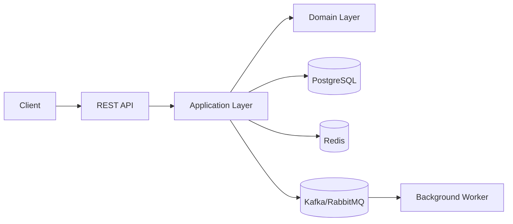

```mermaid
flowchart LR
Client --> API[REST API]
API --> App[Application Layer]
App --> Domain[Domain Layer]
App --> DB[(PostgreSQL)]
App --> Redis[(Redis)]
App --> MQ[(Kafka/RabbitMQ)]
MQ --> Worker[Background Worker]
```